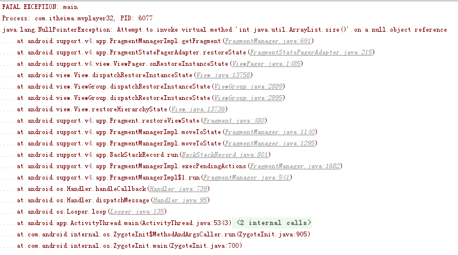
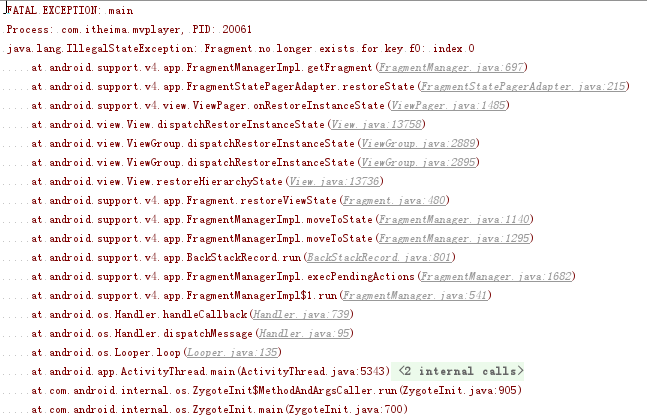

# 项目简介 #
本项目是手机影音项目，展示了视频播放和音乐播放的基本实现。 另外，本项目部分地方使用了MVP模式，对OKhttp用Volley的姿势做了基本的封装。

# MVP介绍 #
[传送门](https://github.com/uncleleonfan/FanChat)

# 项目初始化 #
* 包的创建
* 基类的创建
* Git初始化

# Splash界面 #
## 全屏样式 ##
    
## 缩放动画 ##
	<?xml version="1.0" encoding="utf-8"?>
	<set xmlns:android="http://schemas.android.com/apk/res/android">
	    <scale
	        android:duration="3000"
	        android:fromXScale="1.5"
	        android:fromYScale="1.5"
	        android:pivotX="50%"
	        android:pivotY="50%"
	        android:toXScale="1"
	        android:toYScale="1"/>	
	</set>
## Activity跳转动画 ##
    overridePendingTransition(android.R.anim.fade_in, android.R.anim.fade_out);

# 主界面 #

## 设置菜单 ##
    @Override
    public boolean onCreateOptionsMenu(Menu menu) {
        getMenuInflater().inflate(R.menu.menu_main, menu);
        return true;
    }

    @Override
    public boolean onOptionsItemSelected(MenuItem item) {
        switch (item.getItemId()) {
            case R.id.settings:
                goTo(SettingsActivity.class, false);
                break;
        }
        return true;
    }

## 底部导航条BottomBar ##
[传送门](https://github.com/roughike/BottomBar)

## Fragment切换 ##
    private OnTabSelectListener mOnTabSelectListener = new OnTabSelectListener() {
        @Override
        public void onTabSelected(@IdRes int tabId) {
            FragmentTransaction fragmentTransaction = mFragmentManager.beginTransaction();
            fragmentTransaction.replace(R.id.fragment_container, FragmentFactory.getInstance().getFragment(tabId));
            fragmentTransaction.commit();
        }
    };

# 设置界面 #
## 初始化Action Bar ##
    @Override
    protected void init() {
        super.init();
        //Be careful, we need to use getSupportActionBar instead of getActionBar
        ActionBar supportActionBar = getSupportActionBar();
        supportActionBar.setTitle(R.string.settings);
        supportActionBar.setDisplayHomeAsUpEnabled(true);
    }

## 使用PreferenceFragment ##
注意SettingsFragment必须是public，在布局文件中指定fragment时必须给fragment一个id。

    public static class SettingsFragment extends PreferenceFragment {

        @Override
        public void onCreate(Bundle savedInstanceState) {
            super.onCreate(savedInstanceState);
        }

        @Override
        public View onCreateView(LayoutInflater inflater, ViewGroup container, Bundle savedInstanceState) {
            addPreferencesFromResource(R.xml.settings_prefs);
            return super.onCreateView(inflater, container, savedInstanceState);
        }

        @Override
        public boolean onPreferenceTreeClick(PreferenceScreen preferenceScreen, Preference preference) {
            if (preference.getKey().equals(Constant.SP.ABOUT)) {
                Intent intent = new Intent(getActivity(), AboutActivity.class);
                startActivity(intent);
            }
            return super.onPreferenceTreeClick(preferenceScreen, preference);
        }
    }

## 设置选项 ##
	<?xml version="1.0" encoding="utf-8"?>
	<PreferenceScreen xmlns:android="http://schemas.android.com/apk/res/android">
	    <Preference
	        android:key="clear_cache"
	        android:title="@string/clean_cache"/>
	
	    <SwitchPreference
	        android:key="push_notification"
	        android:title="@string/push_notification"/>
		
	    <SwitchPreference
	        android:key="no_wifi_load_images"
	        android:title="@string/no_wifi_load_images"/>
	
	    <Preference
	        android:key="about"
	        android:title="@string/about"/>
	
	</PreferenceScreen>

## 选项点击处理 ##
    @Override
    public boolean onPreferenceTreeClick(PreferenceScreen preferenceScreen, Preference preference) {
        if (preference.getKey().equals(Constant.SP.ABOUT)) {
             Intent intent = new Intent(getActivity(), AboutActivity.class);
             startActivity(intent);
        }
        return super.onPreferenceTreeClick(preferenceScreen, preference);
    }

## 获取SharedPreference ##
    SharedPreferences defaultSharedPreferences = PreferenceManager.getDefaultSharedPreferences(this);
    boolean aBoolean = defaultSharedPreferences.getBoolean(Constant.SP.NO_WIFI_LOAD_IMAGES, false);

## Activity进出场动画 ##
    

    
**更多动画，请参考[Material Animations](https://github.com/lgvalle/Material-Animations)**

# 首页 #
## 功能需求 ##
* MV列表 （RecyclerView）
* 下拉刷新 (SwipeRefreshLayout)
* 加载更多

# 悦单 #
## 功能需求 ##
* 悦单列表 （RecyclerView）
* 下拉刷新 (SwipeRefreshLayout)
* 加载更多

# 列表的抽取 #
由于首页，悦单，MV界面的列表的布局一致（RecyclerView和SwipeRefreshLayout），业务逻辑一致（加载列表数据，下拉刷新，加载更多数据），所以我们可以进行抽取，避免重复的代码。

## BaseListView ##
View层需要提供的接口非常简单，只需处理数据加载成功或者失败的情况。

	public interface BaseListView {
	
	    void onLoadListDataFailed();
	
	    void onLoadListDataSuccess();
	}

## BaseListFragment ##
BaseListFragment的布局抽取了RecyclerView和SwipeRefreshLayout以及相关的业务逻辑。
### 下拉刷新 ###
    private SwipeRefreshLayout.OnRefreshListener mOnRefreshListener = new SwipeRefreshLayout.OnRefreshListener() {
        @Override
        public void onRefresh() {
            mBaseListPresenter.refresh();
        }
    };

### 加载更多 ###
    private RecyclerView.OnScrollListener mOnScrollListener = new RecyclerView.OnScrollListener() {
        @Override
        public void onScrollStateChanged(RecyclerView recyclerView, int newState) {
            if (newState == RecyclerView.SCROLL_STATE_IDLE) {
                if (isScrollToBottom()) {
                    mBaseListPresenter.loadMoreListData();
                }
            }
        }
    };

    private boolean isScrollToBottom() {
        return mLinearLayoutManager.findLastVisibleItemPosition() == mBaseListPresenter.getListData().size() - 1;
    }
### 加载数据成功或者失败 ###
    public void onLoadListDataSuccess() {
        toast(R.string.load_data_success);
        mAdapter.notifyDataSetChanged();
        mSwipeRefresh.setRefreshing(false);
    }

    @Override
    public void onLoadListDataFailed() {
        toast(R.string.load_data_failed);
    }

### 子类需要实现Adapter和Presenter ###
    public abstract RecyclerView.Adapter getListAdapter();
    public abstract BaseListPresenter getPresenter(BaseListView view);

## BaseListPresenter ##
BaseListPresenter定义了一个BaseListFragment的业务逻辑，由各个界面具体实现该Presenter，比如HomePresenterImpl, YueDanPresenterImpl, MVPagePresenterImpl。

	public interface BaseListPresenter<T> {
	
	    void loadListData();
	
	    List<T> getListData();
	
	    void refresh();
	
	    void loadMoreListData();
	
	}

# MV #
## TabLayout的使用 ##
### TabLayout的配置 ###
    <android.support.design.widget.TabLayout
        android:id="@id/tab_layout"
        android:layout_width="match_parent"
        android:layout_height="wrap_content"
        android:background="@color/colorPrimary"
        app:tabTextColor="@color/gray"
        app:tabSelectedTextColor="@android:color/white"
        app:tabIndicatorColor="@android:color/white"
        app:tabIndicatorHeight="5dp"
        app:tabMode="scrollable">
    </android.support.design.widget.TabLayout>
### 关联ViewPager ###
   	mTabLayout.setupWithViewPager(mViewPager);

## 获取标题 ##
MVAdapter中实现getPageTitle，TayLayout会通过该方法获取标题。

    @Override
    public CharSequence getPageTitle(int position) {
        return mAreas.get(position).getName();
    }
## MVPageFragment实现 ##
### 获取区域码 ###
    public static MVPageFragment newInstance(String code) {
        MVPageFragment itemFragment = new MVPageFragment();
        Bundle bundle = new Bundle();
        bundle.putString("code", code);
        itemFragment.setArguments(bundle);
        return itemFragment;
    }

    @Override
    public void onCreate(@Nullable Bundle savedInstanceState) {
        super.onCreate(savedInstanceState);
        Bundle arguments = getArguments();
        mCode = arguments.getString("code");
    }

### 返回Adpater ###
    @Override
    public RecyclerView.Adapter getListAdapter() {
        return new MVPageListAdapter(getContext(), mMVPagePresenter.getListData());
    }
### 返回Presenter ###
    @Override
    public BaseListPresenter getPresenter(BaseListView view) {
        mMVPagePresenter = new MVPagePresenterImpl(view, mCode);
        return mMVPagePresenter;
    }

## MVPagePresenterImpl实现 ##
### 加载数据 ###
    @Override
    public void loadListData() {
        MVPageRequest.getRequest(mCode, mNetworkListener).execute();
    }
### 返回数据 ###
    @Override
    public List<MVPageBean.VideosBean> getListData() {
        return mVideos;
    }
### 刷新 ###
    @Override
    public void refresh() {
        mVideos.clear();
        MVPageRequest.getRequest(mCode, mNetworkListener).execute();
    }

### 加载更多数据 ###
    @Override
    public void loadMoreListData() {
        MVPageRequest.getLodeMoreRequest(mCode, mVideos.size(), mNetworkListener).execute();
    }

# MV详情界面 #
## 视频播放 ##
### VideoView###
VideoView基于SurfaceView和MediaPlayer
### Vitamio ###
Vitamio基于FFmpeg（[传送门](https://www.vitamio.org/)）
### ijkPlayer ###
ijkPlayer基于FFmpeg，MediaCodec，VideoToolbox ([传送门](https://github.com/Bilibili/ijkplayer))
### JieCaoVideoPlayer ###
JieCaoVideoPlayer基于ijkPlayer([传送门](https://github.com/lipangit/JieCaoVideoPlayer))

# V榜 #
## 查询多媒体数据库 ##
    public void loadAudio(Context context, CursorAdapter cursorAdapter) {
        mCursorAdapter = cursorAdapter;
        Uri uri = MediaStore.Audio.Media.EXTERNAL_CONTENT_URI;
        String[] projection = {MediaStore.Audio.Media._ID, MediaStore.Audio.Media.DATA,
                MediaStore.Audio.Media.TITLE,
                MediaStore.Audio.Media.ARTIST,
                MediaStore.Audio.Media.DURATION,
                MediaStore.Audio.Media.SIZE,
                MediaStore.Audio.Media.DISPLAY_NAME};
        mAudioAsyncQueryHandler = new AudioAsyncQueryHandler(context.getContentResolver());
        mAudioAsyncQueryHandler.startQuery(0, cursorAdapter, uri, projection, null, null, null);
    }

## 通知UI更新 ##
    @Override
    protected void onQueryComplete(int token, Object cookie, Cursor cursor) {
        ((AudioListAdapter)cookie).swapCursor(cursor);
		...
    }

## Android6.0动态权限 ##
Andrioid6.0对权限进行了分组，涉及到用户敏感信息的权限只能动态的去获取。当应用的targetSdkVersion小于23时，
会默认采用以前的权限管理机制，当targetSdkVersion大于等于23时并且运行在Andorid6.0系统上，它才会采用这套新的权限管理机制。

### 参考 ###
* [适配Android6.0动态权限管理](http://www.jianshu.com/p/a37f4827079a)
* [Android6.0权限管理的解析与实战](http://www.jianshu.com/p/a1edba708761)

### 检查权限 ###
    private boolean hasReadExternalStoragePermission() {
        return PackageManager.PERMISSION_GRANTED == ActivityCompat.checkSelfPermission(getContext(), Manifest.permission.READ_EXTERNAL_STORAGE);
    }
### 申请权限 ###
    private void requestPermission() {
        ActivityCompat.requestPermissions(getActivity(), new String[]{Manifest.permission.READ_EXTERNAL_STORAGE}, 0);
    }
### 申请权限回调 ###
    @Override
    public void onRequestPermissionsResult(int requestCode, @NonNull String[] permissions, @NonNull int[] grantResults) {
        switch (requestCode) {
            case 0:
                if (grantResults[0] == PackageManager.PERMISSION_GRANTED) {
                    AudioManager.getInstance().loadAudio(getContext(), mAudioListAdapter);
                } else {
                    toast(R.string.read_storage_permission_deny);
                }
                break;
        }
    }
# 音乐播放界面 #
## 在服务中播放歌曲 ##
    @Override
    public int onStartCommand(Intent intent, int flags, int startId) {
        int position = intent.getIntExtra(Constant.Extra.AUDIO_POSITION, -1);
        if (position != POSITION_NOT_FOUND) {
            //如果MusicPlayService正在播放的歌曲就是用户打开播放界面要播放的歌曲，则直接通知Activity已经开始播放，
            //直接更新进度
            if (mPosition == position) {
                notifyStartPlay();
            } else {
                mPosition = position;
                startPlay();
            }
        }
        return super.onStartCommand(intent, flags, startId);
    }

## 启动播放 ##
    public void startPlay() {
        //当开始播放一首歌曲时，如果MediaPlayer不为空，表示之前已经播放了一首歌曲，这时需要重置MediaPlayer
        if (mMediaPlayer != null) {
            mMediaPlayer.reset();
            mMediaPlayer.release();
            mMediaPlayer = null;
        }
        mMediaPlayer = new MediaPlayer();
        String path = MusicManager.getInstance().getAudioItem(mPosition).getData();
        try {
            mMediaPlayer.setDataSource(path);//设置歌曲路径
            mMediaPlayer.setOnPreparedListener(mOnPreparedListener);//设置准备监听器
            mMediaPlayer.setOnCompletionListener(mOnCompletionListener);//设置播放结束监听器
            mMediaPlayer.prepare();//准备
        } catch (IOException e) {
            e.printStackTrace();
        }
    }

## 监听MusicPlayerService开始播放的广播 ##
    private void registerBroadcast() {
        IntentFilter intentFilter = new IntentFilter();
        //监听开始播放的ACTION
        intentFilter.addAction(MusicPlayerService.ACTION_START_PLAY);
        registerReceiver(mUpdateReceiver, intentFilter);
    }

    private BroadcastReceiver mUpdateReceiver = new BroadcastReceiver() {
        @Override
        public void onReceive(Context context, Intent intent) {
            String action = intent.getAction();
            if (action.equals(MusicPlayerService.ACTION_START_PLAY)) {
                int pos = intent.getIntExtra(Constant.Extra.AUDIO_POSITION, -1);
                updateStartPlay(pos);
            }
        }
    };

## 绑定和解绑服务 ##
    @Override
    protected void onResume() {
        super.onResume();
        Intent intent = new Intent(this, MusicPlayService.class);
        bindService(intent, mServiceConnection, BIND_AUTO_CREATE);
    }

    @Override
    protected void onPause() {
        super.onPause();
        unbindService(mServiceConnection);
        stopUpdateProgress();
    }

## 获取服务代理 ##
    private ServiceConnection mServiceConnection = new ServiceConnection() {
        @Override
        public void onServiceConnected(ComponentName name, IBinder service) {
            mAudioPlayerProxy = (MusicPlayService.AudioPlayerProxy) service;
        }

        @Override
        public void onServiceDisconnected(ComponentName name) {
            mAudioPlayerProxy = null;
        }
    };

## 播放和暂停 ##
	//MusicPlayerActivity
    case R.id.iv_play:
        mAudioPlayerProxy.togglePlay();
        if (mAudioPlayerProxy.isPlaying()) {
            updateStartPlay();
        }  else {
            updatePausePlay();
        }
		break;
	//MusicPlayerSerivice
    public void togglePlay() {
        if (mMediaPlayer.isPlaying()) {
            mMediaPlayer.pause();
        } else {
            mMediaPlayer.start();
        }
    }

## 音乐数据模块的抽取 ##
在音乐列表界面，我们需要数据列表来渲染UI, 在音乐播放界面，我们同样需要数据列表来实现播放上一首和下一首，我们不可能每个界面都加载一次数据。
这时候，我们就有必要对音乐数据做一个抽取，做成一个独立的模块来服务APP中不同的界面。

### MusicManger ###
MusicManager管理App中要用到的音乐数据，使用单例模式。

    private MusicManager() {}

    public static MusicManager getInstance() {
        if (mAudioManager == null) {
            synchronized (MusicManager.class) {
                if (mAudioManager == null) {
                    mAudioManager = new MusicManager();
                }
            }
        }
        return mAudioManager;
    }

### 加载音乐数据 ###
    public void loadAudio(Context context, CursorAdapter cursorAdapter) {
        mCursorAdapter = cursorAdapter;
        Uri uri = MediaStore.Audio.Media.EXTERNAL_CONTENT_URI;
        String[] projection = {MediaStore.Audio.Media._ID, MediaStore.Audio.Media.DATA,
                MediaStore.Audio.Media.TITLE,
                MediaStore.Audio.Media.ARTIST,
                MediaStore.Audio.Media.DURATION,
                MediaStore.Audio.Media.SIZE,
                MediaStore.Audio.Media.DISPLAY_NAME};
        mAudioAsyncQueryHandler = new AudioAsyncQueryHandler(context.getContentResolver());
        mAudioAsyncQueryHandler.startQuery(0, cursorAdapter, uri, projection, null, null, null);
    }

### 返回某个位置的音乐数据 ###
    /**
     * 返回音乐列表position位置的音乐数据
     */
    public AudioItemBean getAudioItem(int position) {
        return mAudioAsyncQueryHandler.getAudioItemBeanList().get(position);
    }
### 返回音乐列表大小 ###
    /**
     * 返回音乐列表大小
     */
    public int getAudioCount() {
        return mAudioAsyncQueryHandler.getAudioItemBeanList().size();
    }

## 播放下一首 ##
	//MusicPlayerActivity
    case R.id.iv_next:
        if (mAudioPlayerProxy.isLast()) {
            toast(R.string.is_last_audio);
        } else {
            mAudioPlayerProxy.playNext();
        }
        break;

	//MusicPlayerService
    public void playNext() {
        mPosition++;
        startPlay();
    }

## 播放上一首 ##
	//MusicPlayerActivity
    case R.id.iv_pre:
        if (mAudioPlayerProxy.isFirst()) {
            toast(R.string.is_first_audio);
        } else {
            mAudioPlayerProxy.playPre();
        }
        break;

	//MusicPlayerService
    public void playPre() {
        mPosition--;
        startPlay();
    }

## 播放模式 ##
当播放歌曲结束后，我们根据播放模式来播放下一首歌曲。

### 切换播放模式 ###
	//MusicPlayerActivity
    case R.id.iv_play_mode:
         mAudioPlayerProxy.updatePlayMode();
         updatePlayModeView(mAudioPlayerProxy.getPlayMode());
         break;

	//MusicPlayerService
    public void updatePlayMode() {
        mCurrentMode = (mCurrentMode + 1) % 3;
    }

### 播放结束后播放下一首 ###
    private MediaPlayer.OnCompletionListener mOnCompletionListener = new MediaPlayer.OnCompletionListener() {
        @Override
        public void onCompletion(MediaPlayer mp) {
            playByMode();
        }
    };

    private void playByMode() {
        int count = MusicManager.getInstance().getAudioCount();
        switch (mCurrentMode) {
            case PLAY_MODE_ORDER:
                mPosition = (mPosition + 1) % count;
                break;
            case PLAY_MODE_RANDOM:
                mPosition = new Random().nextInt(count);
                break;
            case PLAY_MODE_SINGLE:
                break;
        }
        startPlay();
    }

## 自定义歌词 ##
### 绘制单行文本 ###
    private void drawSingleLine(Canvas canvas, String text) {
        mPaint.getTextBounds(text, 0, text.length(), mTextRect);
        mPaint.setColor(Color.WHITE);
        float x = mCenterX - mTextRect.width() / 2;
        float y = mCenterY + mTextRect.height() / 2;
        canvas.drawText(text, x, y, mPaint);
    }

### 解析歌词 ###
    /**
     * 解析一行文本，转换成歌词的bean集合
     *
     * @param readLine 读取的一行文本
     * @return 解析的结果
     */
    private static List<LyricBean> parseLyricLine(String readLine) {
        List<LyricBean> lyrics = new ArrayList<LyricBean>();
        //[01:22.04][02:35.04]寂寞的夜和谁说话
        String[] arrays = readLine.split("]");
        //[01:22.04    [02:35.04    寂寞的夜和谁说话
        for (int i = 0; i < arrays.length - 1; i++) {
            LyricBean lyricBean = new LyricBean();
            lyricBean.setTimestamp(parseTimeStamp(arrays[i]));
            lyricBean.setLyric(arrays[arrays.length - 1]);
            lyrics.add(lyricBean);
        }
        return lyrics;
    }

    /**
     *  解析歌词的时间戳
     */
    private static int parseTimeStamp(String time) {
        //[01:22.04
        String[] array1 = time.split(":");
        //[01  22.04
        String minute = array1[0].substring(1);//01
        //22.04
        String[] array2 = array1[1].split("\\.");
        // 22 04
        String second  = array2[0];
        String millis = array2[1];

        return Integer.parseInt(minute) * 60 * 1000 + Integer.parseInt(second) * 1000 + Integer.parseInt(millis);
    }

### 歌词排序 ###
    //歌词按照时间戳进行排序
    Collections.sort(lyricBeanList, new Comparator<LyricBean>() {
        @Override
        public int compare(LyricBean o1, LyricBean o2) {
            return o1.getTimestamp() - o2.getTimestamp();//升序排列
        }
    });

### 绘制歌词 ###
    /**
     *
     *  根据当前歌曲播放的进度，计算出高亮歌词的位置
     *
     * @param progress 当前歌曲的播放进度
     * @param duration 歌曲的时长
     */
    public void roll(int progress, int duration) {
        for (int i = 0; i < mLyrics.size(); i++) {
            int start = mLyrics.get(i).getTimestamp();
            int end = 0;
            if (i == mLyrics.size() - 1) {
                end = duration;//如果是最后一行歌词，该行歌词的结束时间为歌曲的时长
            } else {
                end = mLyrics.get(i + 1).getTimestamp();
            }
            //判断当前播放进度是否在该行歌词内
            if (progress > start && progress <= end) {
                mHighLightPosition = i;
                int lineDuration  = end - start;//获取该行歌词的时长
                int passed = progress - start;//获取当前该行歌词已播放了多长时间
                //获取歌词的偏移量
                mOffset = passed * 1.0f / lineDuration * mLineHeight;
                invalidate();
                break;
            }
        }
    }

    /**
     * 绘制歌词
     * @param canvas 画布
     */
    private void drawLyrics(Canvas canvas) {
        for (int i = 0; i < mLyrics.size(); i++) {
            //初始化画笔
            if (mHighLightPosition == i) {
                mPaint.setColor(Color.GREEN);
                mPaint.setTextSize(mHighLightTextSize);
            } else {
                mPaint.setColor(Color.WHITE);
                mPaint.setTextSize(mNormalTextSize);
            }
            //测量歌词文本
            String text = mLyrics.get(i).getLyric();
            mPaint.getTextBounds(text, 0, text.length(), mTextRect);
            //计算歌词绘制的位置
            float x = mCenterX - mTextRect.width() / 2;
            float y = mCenterY + mTextRect.height() / 2 + (i - mHighLightPosition) * mLineHeight - mOffset;
            canvas.drawText(text, x, y, mPaint);
        }
    }

# 趟坑记 #
## 下拉刷新时切换Fragment ##
### BUG ###
当下拉刷新时，迅速从首页切换到MV界面，就会出现重影：

### 原因 ###
这是已知[BUG](https://code.google.com/p/android/issues/detail?id=78062)

### 解决方法 ###
在SwipeRefreshLayout外面套一层FrameLayout。

	<?xml version="1.0" encoding="utf-8"?>
	<FrameLayout
	    xmlns:android="http://schemas.android.com/apk/res/android"
	    android:layout_width="match_parent"
	    android:layout_height="match_parent">
	    <android.support.v4.widget.SwipeRefreshLayout
	        android:id="@id/swipe_refresh"
	        android:layout_width="match_parent"
	        android:layout_height="match_parent">
	
	        <android.support.v7.widget.RecyclerView
	            android:id="@id/recycler_view"
	            android:layout_width="match_parent"
	            android:layout_height="match_parent">
	        </android.support.v7.widget.RecyclerView>
	    </android.support.v4.widget.SwipeRefreshLayout>
	</FrameLayout>

## 第二次点击进入MV界面 ##
### BUG ###

### 原因 ###
由于我们对MVFragment的做了缓存，当再次切换到MVFragment的时候，不会重新创建，
而是调用它的restoreViewState的方法去恢复它的状态，进而调用到FragmentStatePagerAdapter的restoreState的方法，
而此时FragmentStatePagerAdapter是一个重新创建的adapter，它内部的FragmentManager也是一个全新的对象，内部的Active的Fragment的集合为空，当然会报空指针。
这时候有同学就说，那就缓存原来的Adapter或者原来的FragmentManager，但即使这样做，还是会出现异常：

这是由于从MVFragment切换到别的Fragment的时候，会清除里面所有的子Fragment,恢复状态时再去查找对应的Fragment是找不到的。

### 解决方法 ###
重写MVAdapter里面的saveState的方法：

    @Override
    public Parcelable saveState() {
        return null;
    }

或者restoreState的方法：

    @Override
    public void restoreState(Parcelable state, ClassLoader loader) {
    }